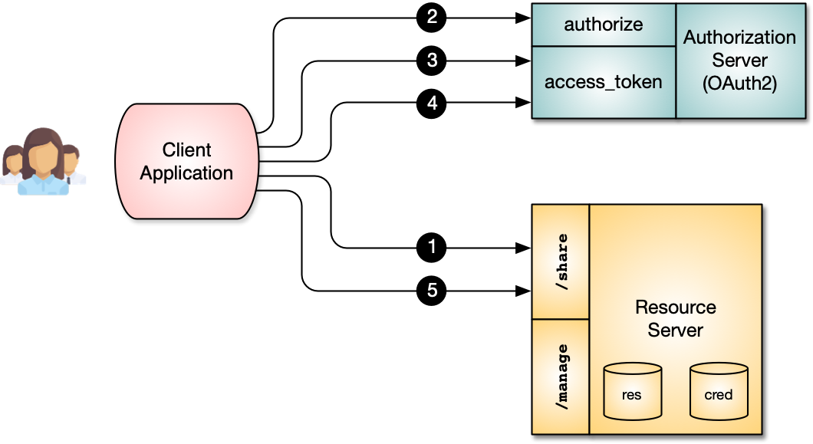
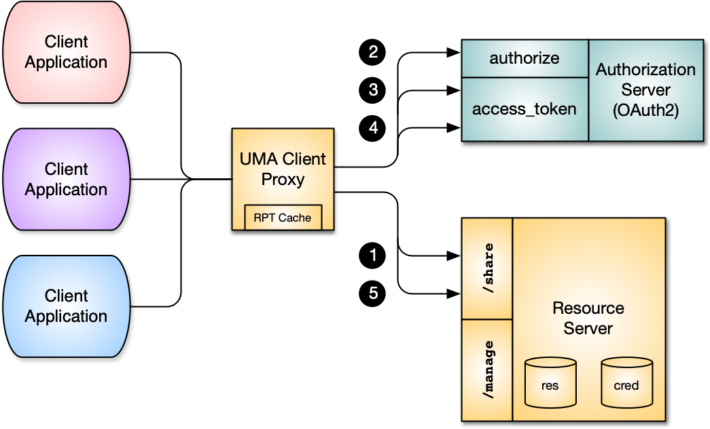

# frdp-uma-client-proxy

ForgeRock Demonstration Platform : **UMA Client Proxy** : A gateway and "REST proxy" for [User-Managed Access (UMA) 2.0](https://kantarainitiative.org/confluence/display/uma/Home) Requesting Party Clients.  The UMA Client Proxy provides a simplified interface to the [UMA 2.0 Grant for OAuth 2.0 Authorization](https://docs.kantarainitiative.org/uma/wg/rec-oauth-uma-grant-2.0.html) flow.

A typical UMA client flow has the following steps: 

1. The **Requesting Party** (using the Client Application) makes a request to obtain the "resource", from the **Resource Server**. The **Resource Server** returns a `Permission Ticket` because of either a missing or invalid `Requesting Party Token (RPT)`.
1. The **Requesting Party** needs to authenticated with the **Authorization Server** and obtain an OAuth `authorization code`.
1. The `authorization code` and the Client OAuth credentials are used to obtain a `Claim Token` from the **Authorization Server**.
1. Using the `Permission Ticket` and the `Claim Token` ... the `Requesting Party Token (RPT)` is obtained from the **Authorization Server**.
1. With a valid `Requesting Party Token (RPT)` ... the request for the "resource" is re-submitted to the **Resource Server**.  The "resource" is returned.

Each UMA **Requesting Party** Client Application will need to implement all of these steps to support the UMA flow.  The **UMA Client Proxy** simplifies Client Application development.  A single REST call is made. The **UMA Client Proxy** can cache `Requesting Party Tokens (RPT)` for improved performance.

| Direct Client flow | | Proxy flow |
| ------ | ----- | ---- |
|  | <&nbsp;-&nbsp;-&nbsp;-&nbsp;> |  |
`git clone https://github.com/ForgeRock/frdp-uma-client-proxy.git`

# Disclaimer

THE SOFTWARE IS PROVIDED "AS IS", WITHOUT WARRANTY OF ANY KIND, EXPRESS OR IMPLIED, INCLUDING BUT NOT LIMITED TO THE WARRANTIES OF MERCHANTABILITY, FITNESS FOR A PARTICULAR PURPOSE AND NONINFRINGEMENT. IN NO EVENT SHALL THE AUTHORS OR COPYRIGHT HOLDERS BE LIABLE FOR ANY CLAIM, DAMAGES OR OTHER LIABILITY, WHETHER IN AN ACTION OF CONTRACT, TORT OR OTHERWISE, ARISING FROM, OUT OF OR IN CONNECTION WITH THE SOFTWARE OR THE USE OR OTHER DEALINGS IN THE SOFTWARE.

# License

[MIT](/LICENSE)

# Reference 

- Specification: [User-Managed Access (UMA) 2.0 Grant for OAuth 2.0 Authorization](https://docs.kantarainitiative.org/uma/wg/rec-oauth-uma-grant-2.0.html)
- Specification: [Federated Authorization for User-Managed Access (UMA) 2.0](https://docs.kantarainitiative.org/uma/wg/rec-oauth-uma-federated-authz-2.0.html)
- Documentation: [ForgeRock Access Manager 7, User Managed Access (UMA) 2.0 Guide](https://backstage.forgerock.com/docs/am/7/uma-guide/)

# Overview

This repository supports multiple sub-projects:

| Name | Description |
| ---- | ----------- |
| `gateway` | The core logic for processing the UMA Client flow and supports caching.  The output is a JAR file provides Java classes that can be used by stand-alone REST service or embedded into an existing service. |
| `proxy` | The REST web service that provides the simplified interface for the **UMA Client Application**.  This project leverages the `gateway` project. 

# Requirements

The following items must be installed:

1. [Apache Maven](https://maven.apache.org/) *(tested with 3.5.x, 3.6.x)*
1. [Java Development Kit 11](https://openjdk.java.net/projects/jdk/11/)
1. [Apache Tomcat](https://tomcat.apache.org/index.html) *(tested with Tomcat 9.0.x)*
1. [ForgeRock Access Manager](https://www.forgerock.com/platform/access-management) *(tested with 7.0)*
1. [UMA Resource Server](https://github.com/ForgeRock/frdp-uma-resource-server)

# Build

## Prerequisite:

The following items must be completed, in the following order:

1. [frdp-framework](https://github.com/ForgeRock/frdp-framework) ... clone / download then install using *Maven* (`mvn`)

## Gateway:

Run *Maven* (`mvn`) processes to clean, compile and install the jar file:

```bash
cd gateway
mvn clean compile install
```

## Proxy:

Run *Maven* (`mvn`) processes to clean, compile and package the war file:

```bash
cd proxy
mvn clean compile package
```

